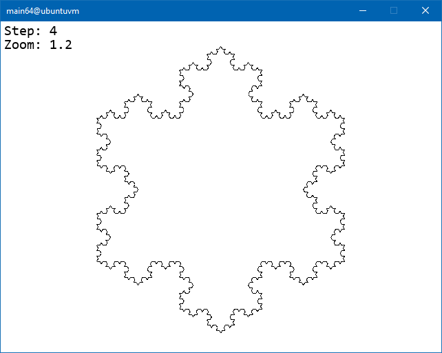

# KochCurve

Interactive koch curve fractal. Runs on Linux systems.

Written in C with Allegro5 support and assembly (both x86 and x86_64). Algorithm uses SSE instruction set for computing points of fractal. 

To compile, use makefile. It's compiling both 32 and 64 bit version. If you want to compile only for one architecture, edit makefile and comment out unnecessary commands.

Prerequisites to compile:
- gcc
- nasm
- allegro5.2

